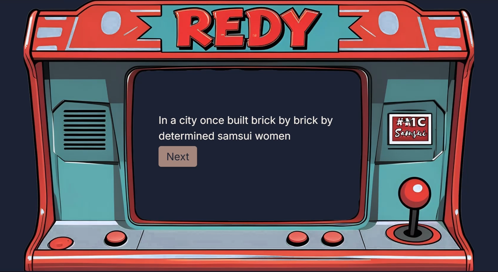

# :floppy_disk: Redy
**:trophy: Second Runner Up - National AI Student Challenge 2025 Hackathon - Temus Track**  
Redy is a career preparation tool used for interview practice and career planning. Inspired by the resilient spirit of the Samsui women, Redy adopts a gamified approach for job seekers to hone their skills by speaking with AI avatars powered by Claude Sonnet 4.

*▶ Click to watch the product demo*
 

## :star2: Features
### :necktie: Interview Practice
Upload a resume, choose what to focus on in the practice, and start speaking with an AI interviewer as though it is the real thing! \
With feedback given after every question, keep practicing until you feel confident for the real deal!

### :speech_balloon: Career Counselling
Feeling lost is a natural part of job seeking. Speak with our friendly AI career counsellor for a tailored counselling session to explore career options, identify portfolio weaknesses, and more!

 

## :wrench: Technical Implementation
* Redy's front-end is built on Angular, while its back-end is built on Django.
* Connections to Temus's backend server to display the avatar's image and voice are made using Websockets and WebRTC.
* Resume information is stored as a `.json` file due to limitations with the avatar server only allowing one connection at once.
 

## :link: Related Resources
Unfortunately, as the avatar backend is no longer available after the hackathon, Redy is no longer accessible.\
However, you can learn more about Redy from our [product demo](https://youtu.be/XoyPa0yeiAI).\
The sample code for connecting to the avatar backend can be found [here](https://github.com/tplusplusdevhub/temus-avatar-nextjs-sample-code)
